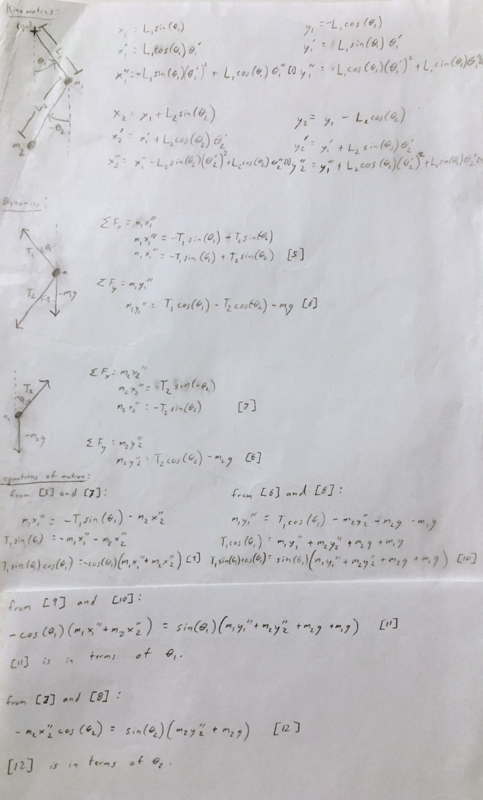
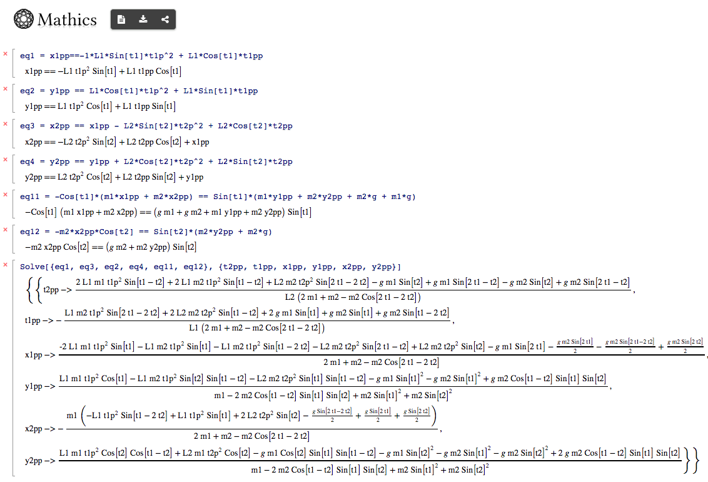

# Double Pendulum
10/30/2018

Simulation of a double pendulum written in ECMA script.  
[See it in action.](https://lemmingapex.github.io/double-pendulum/dist/)

## Build and Run It

1. `npm install`
2. `npm run build`
3. open ./dist/index.html in google chrome.

## About

This simulation attempts to semi-accurately represent the motion of a [double pendulum](https://en.wikipedia.org/wiki/Double_pendulum).

The equations of motion can be found directly from the equations describing the kinematics and dynamics of the system.

### Kinematics, Dynamics & Equations of Motion



Using equation [11] & [12] and [1], [2], [3] & [4], two explicit equations for the angular acceleration, θ₁′′ and θ₂′′, can expressed.  I used [mathics](https://mathics.github.io/), a free CAS (computer algebra system), to do the algebra for me:

```
eq1 = x1pp==-1*L1*Sin[t1]*t1p^2 + L1*Cos[t1]*t1pp
eq2 = y1pp == L1*Cos[t1]*t1p^2 + L1*Sin[t1]*t1pp
eq3 = x2pp == x1pp - L2*Sin[t2]*t2p^2 + L2*Cos[t2]*t2pp
eq4 = y2pp == y1pp + L2*Cos[t2]*t2p^2 + L2*Sin[t2]*t2pp
eq11 = -Cos[t1]*(m1*x1pp + m2*x2pp) == Sin[t1]*(m1*y1pp + m2*y2pp + m2*g + m1*g)
eq12 = -m2*x2pp*Cos[t2] == Sin[t2]*(m2*y2pp + m2*g)
Solve[{eq1, eq3, eq2, eq4, eq11, eq12}, {t2pp, t1pp, x1pp, y1pp, x2pp, y2pp}]
```



The equations for t1pp and t2pp above are the equations of motion of interest.

In order to get the semi-accurate behavior, I am using an explicit [RK4](https://en.wikipedia.org/wiki/Runge–Kutta_methods) integration method to solve the ODEs.  Implicit methods would be preferred, but I am lazy and did not pursue this approach.

### Other

The chaotic behavior of the masses trajectories at large angles of theta are pretty interesting.

### Future Work and Ideas
* Make the simulation more interactive.
* Triple pendulum system?
* [Inverted pendulums?](https://en.wikipedia.org/wiki/Double_inverted_pendulum)
